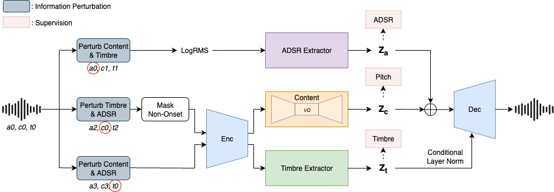
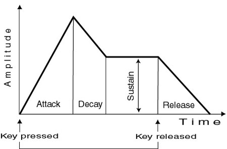
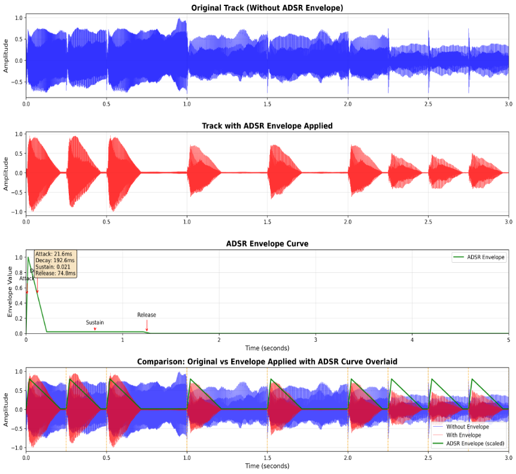

 

<h1>SynthCloner: Synthesizer Preset Conversion via Factorized Codec with Disentangled Timbre and ADSR Control</h1>
Code is available <a href="https://github.com/buffett0323/query_ss">here</a>

## Abstract

This collection presents 32 audio pairs, each containing 6 distinct audio files for comprehensive audio analysis and comparison. Each pair includes original audio, reference audio, ground truth audio, proposed model, CTD <a href="#note1" id="note1ref">[1]</a>, and SS-VQVAE <a href="#note2" id="note2ref">[2]</a>, enabling detailed evaluation of multiple audio processing methods and reconstruction quality. The dataset provides a standardized framework for comparing different audio reconstruction approaches across various audio content types.

 
Figure 1: Model framework

## ADSR Definition
As shown in Figure 2, ADSR stands for <b>Attack</b>, <b>Decay</b>, <b>Sustain</b>, <b>Release</b>, and it is a standard envelope model used in sound synthesis to shape how a note evolves over time. The attack phase, illustrated by the initial rising slope, is the time it takes for the sound to rise from silence to its maximum amplitude after a note is pressed. The decay phase follows, shown by the descending curve, describing how quickly the sound decreases from the peak to the sustain level. The sustain, represented by the horizontal line, is not a time but a level, representing the steady amplitude maintained as long as the note is held. Finally, the release phase, depicted by the final downward slope, is the time it takes for the sound to fade back to silence after the note is released. Together, these 4 stages give electronic instruments their dynamic and expressive qualities, mimicking the way acoustic instruments naturally produce sound.

 
Figure 2: Visualization of the ADSR envelope

## Audio Pairs Collection

This section presents all 32 audio pairs, each containing 6 audio files for comprehensive comparison and analysis. For each pair, we present the original audio, reference audio, ground truth audio, proposed model, CTD, and SS-VQVAE.

Scroll to see all the results if necessary.

<table class="table table-sm text-center" style="vertical-align: middle;">
  <colgroup>
      <col style="width: 120px;">
      <col style="width: 160px;">
      <col style="width: 160px;">
      <col style="width: 160px;">
      <col style="width: 160px;">
      <col style="width: 160px;">
      <col style="width: 160px;">
    </colgroup>
  <thead>
    <tr>
      <th style="text-align:center;">Pair ID</th>
      <th style="text-align:center;">Original</th>
      <th style="text-align:center;">Reference</th>
      <th style="text-align:center;">Ground Truth</th>
      <th style="text-align:center;">Proposed</th>
      <th style="text-align:center;">CTD</th>
      <th style="text-align:center;">SSVQVAE</th>
    </tr>
  </thead>
  <tbody>
    <tr>
      <td>Pair 01</td>
      <td><audio src="audios/01_orig.wav" controls style="width: 160px"></audio></td>
      <td><audio src="audios/01_ref.wav" controls style="width: 160px"></audio></td>
      <td><audio src="audios/01_gt.wav" controls style="width: 160px"></audio></td>
      <td><audio src="audios/01_recon_proposed.wav" controls style="width: 160px"></audio></td>
      <td><audio src="audios/01_recon_ctd.wav" controls style="width: 160px"></audio></td>
      <td><audio src="audios/01_recon_ssvqvae.wav" controls style="width: 160px"></audio></td>
    </tr>
    <tr>
      <td>Pair 02</td>
      <td><audio src="audios/02_orig.wav" controls style="width: 160px"></audio></td>
      <td><audio src="audios/02_ref.wav" controls style="width: 160px"></audio></td>
      <td><audio src="audios/02_gt.wav" controls style="width: 160px"></audio></td>
      <td><audio src="audios/02_recon_proposed.wav" controls style="width: 160px"></audio></td>
      <td><audio src="audios/02_recon_ctd.wav" controls style="width: 160px"></audio></td>
      <td><audio src="audios/02_recon_ssvqvae.wav" controls style="width: 160px"></audio></td>
    </tr>
    <tr>
      <td>Pair 03</td>
      <td><audio src="audios/03_orig.wav" controls style="width: 160px"></audio></td>
      <td><audio src="audios/03_ref.wav" controls style="width: 160px"></audio></td>
      <td><audio src="audios/03_gt.wav" controls style="width: 160px"></audio></td>
      <td><audio src="audios/03_recon_proposed.wav" controls style="width: 160px"></audio></td>
      <td><audio src="audios/03_recon_ctd.wav" controls style="width: 160px"></audio></td>
      <td><audio src="audios/03_recon_ssvqvae.wav" controls style="width: 160px"></audio></td>
    </tr>
    <tr>
      <td>Pair 04</td>
      <td><audio src="audios/04_orig.wav" controls style="width: 160px"></audio></td>
      <td><audio src="audios/04_ref.wav" controls style="width: 160px"></audio></td>
      <td><audio src="audios/04_gt.wav" controls style="width: 160px"></audio></td>
      <td><audio src="audios/04_recon_proposed.wav" controls style="width: 160px"></audio></td>
      <td><audio src="audios/04_recon_ctd.wav" controls style="width: 160px"></audio></td>
      <td><audio src="audios/04_recon_ssvqvae.wav" controls style="width: 160px"></audio></td>
    </tr>
    <tr>
      <td>Pair 05</td>
      <td><audio src="audios/05_orig.wav" controls style="width: 160px"></audio></td>
      <td><audio src="audios/05_ref.wav" controls style="width: 160px"></audio></td>
      <td><audio src="audios/05_gt.wav" controls style="width: 160px"></audio></td>
      <td><audio src="audios/05_recon_proposed.wav" controls style="width: 160px"></audio></td>
      <td><audio src="audios/05_recon_ctd.wav" controls style="width: 160px"></audio></td>
      <td><audio src="audios/05_recon_ssvqvae.wav" controls style="width: 160px"></audio></td>
    </tr>
    <tr>
      <td>Pair 06</td>
      <td><audio src="audios/06_orig.wav" controls style="width: 160px"></audio></td>
      <td><audio src="audios/06_ref.wav" controls style="width: 160px"></audio></td>
      <td><audio src="audios/06_gt.wav" controls style="width: 160px"></audio></td>
      <td><audio src="audios/06_recon_proposed.wav" controls style="width: 160px"></audio></td>
      <td><audio src="audios/06_recon_ctd.wav" controls style="width: 160px"></audio></td>
      <td><audio src="audios/06_recon_ssvqvae.wav" controls style="width: 160px"></audio></td>
    </tr>
    <tr>
      <td>Pair 07</td>
      <td><audio src="audios/07_orig.wav" controls style="width: 160px"></audio></td>
      <td><audio src="audios/07_ref.wav" controls style="width: 160px"></audio></td>
      <td><audio src="audios/07_gt.wav" controls style="width: 160px"></audio></td>
      <td><audio src="audios/07_recon_proposed.wav" controls style="width: 160px"></audio></td>
      <td><audio src="audios/07_recon_ctd.wav" controls style="width: 160px"></audio></td>
      <td><audio src="audios/07_recon_ssvqvae.wav" controls style="width: 160px"></audio></td>
    </tr>
    <tr>
      <td>Pair 08</td>
      <td><audio src="audios/08_orig.wav" controls style="width: 160px"></audio></td>
      <td><audio src="audios/08_ref.wav" controls style="width: 160px"></audio></td>
      <td><audio src="audios/08_gt.wav" controls style="width: 160px"></audio></td>
      <td><audio src="audios/08_recon_proposed.wav" controls style="width: 160px"></audio></td>
      <td><audio src="audios/08_recon_ctd.wav" controls style="width: 160px"></audio></td>
      <td><audio src="audios/08_recon_ssvqvae.wav" controls style="width: 160px"></audio></td>
    </tr>
    <tr>
      <td>Pair 09</td>
      <td><audio src="audios/09_orig.wav" controls style="width: 160px"></audio></td>
      <td><audio src="audios/09_ref.wav" controls style="width: 160px"></audio></td>
      <td><audio src="audios/09_gt.wav" controls style="width: 160px"></audio></td>
      <td><audio src="audios/09_recon_proposed.wav" controls style="width: 160px"></audio></td>
      <td><audio src="audios/09_recon_ctd.wav" controls style="width: 160px"></audio></td>
      <td><audio src="audios/09_recon_ssvqvae.wav" controls style="width: 160px"></audio></td>
    </tr>
    <tr>
      <td>Pair 10</td>
      <td><audio src="audios/10_orig.wav" controls style="width: 160px"></audio></td>
      <td><audio src="audios/10_ref.wav" controls style="width: 160px"></audio></td>
      <td><audio src="audios/10_gt.wav" controls style="width: 160px"></audio></td>
      <td><audio src="audios/10_recon_proposed.wav" controls style="width: 160px"></audio></td>
      <td><audio src="audios/10_recon_ctd.wav" controls style="width: 160px"></audio></td>
      <td><audio src="audios/10_recon_ssvqvae.wav" controls style="width: 160px"></audio></td>
    </tr>
    <tr>
      <td>Pair 11</td>
      <td><audio src="audios/11_orig.wav" controls style="width: 160px"></audio></td>
      <td><audio src="audios/11_ref.wav" controls style="width: 160px"></audio></td>
      <td><audio src="audios/11_gt.wav" controls style="width: 160px"></audio></td>
      <td><audio src="audios/11_recon_proposed.wav" controls style="width: 160px"></audio></td>
      <td><audio src="audios/11_recon_ctd.wav" controls style="width: 160px"></audio></td>
      <td><audio src="audios/11_recon_ssvqvae.wav" controls style="width: 160px"></audio></td>
    </tr>
    <tr>
      <td>Pair 12</td>
      <td><audio src="audios/12_orig.wav" controls style="width: 160px"></audio></td>
      <td><audio src="audios/12_ref.wav" controls style="width: 160px"></audio></td>
      <td><audio src="audios/12_gt.wav" controls style="width: 160px"></audio></td>
      <td><audio src="audios/12_recon_proposed.wav" controls style="width: 160px"></audio></td>
      <td><audio src="audios/12_recon_ctd.wav" controls style="width: 160px"></audio></td>
      <td><audio src="audios/12_recon_ssvqvae.wav" controls style="width: 160px"></audio></td>
    </tr>
    <tr>
      <td>Pair 13</td>
      <td><audio src="audios/13_orig.wav" controls style="width: 160px"></audio></td>
      <td><audio src="audios/13_ref.wav" controls style="width: 160px"></audio></td>
      <td><audio src="audios/13_gt.wav" controls style="width: 160px"></audio></td>
      <td><audio src="audios/13_recon_proposed.wav" controls style="width: 160px"></audio></td>
      <td><audio src="audios/13_recon_ctd.wav" controls style="width: 160px"></audio></td>
      <td><audio src="audios/13_recon_ssvqvae.wav" controls style="width: 160px"></audio></td>
    </tr>
    <tr>
      <td>Pair 14</td>
      <td><audio src="audios/14_orig.wav" controls style="width: 160px"></audio></td>
      <td><audio src="audios/14_ref.wav" controls style="width: 160px"></audio></td>
      <td><audio src="audios/14_gt.wav" controls style="width: 160px"></audio></td>
      <td><audio src="audios/14_recon_proposed.wav" controls style="width: 160px"></audio></td>
      <td><audio src="audios/14_recon_ctd.wav" controls style="width: 160px"></audio></td>
      <td><audio src="audios/14_recon_ssvqvae.wav" controls style="width: 160px"></audio></td>
    </tr>
    <tr>
      <td>Pair 15</td>
      <td><audio src="audios/15_orig.wav" controls style="width: 160px"></audio></td>
      <td><audio src="audios/15_ref.wav" controls style="width: 160px"></audio></td>
      <td><audio src="audios/15_gt.wav" controls style="width: 160px"></audio></td>
      <td><audio src="audios/15_recon_proposed.wav" controls style="width: 160px"></audio></td>
      <td><audio src="audios/15_recon_ctd.wav" controls style="width: 160px"></audio></td>
      <td><audio src="audios/15_recon_ssvqvae.wav" controls style="width: 160px"></audio></td>
    </tr>
    <tr>
      <td>Pair 16</td>
      <td><audio src="audios/16_orig.wav" controls style="width: 160px"></audio></td>
      <td><audio src="audios/16_ref.wav" controls style="width: 160px"></audio></td>
      <td><audio src="audios/16_gt.wav" controls style="width: 160px"></audio></td>
      <td><audio src="audios/16_recon_proposed.wav" controls style="width: 160px"></audio></td>
      <td><audio src="audios/16_recon_ctd.wav" controls style="width: 160px"></audio></td>
      <td><audio src="audios/16_recon_ssvqvae.wav" controls style="width: 160px"></audio></td>
    </tr>
    <tr>
      <td>Pair 17</td>
      <td><audio src="audios/17_orig.wav" controls style="width: 160px"></audio></td>
      <td><audio src="audios/17_ref.wav" controls style="width: 160px"></audio></td>
      <td><audio src="audios/17_gt.wav" controls style="width: 160px"></audio></td>
      <td><audio src="audios/17_recon_proposed.wav" controls style="width: 160px"></audio></td>
      <td><audio src="audios/17_recon_ctd.wav" controls style="width: 160px"></audio></td>
      <td><audio src="audios/17_recon_ssvqvae.wav" controls style="width: 160px"></audio></td>
    </tr>
    <tr>
      <td>Pair 18</td>
      <td><audio src="audios/18_orig.wav" controls style="width: 160px"></audio></td>
      <td><audio src="audios/18_ref.wav" controls style="width: 160px"></audio></td>
      <td><audio src="audios/18_gt.wav" controls style="width: 160px"></audio></td>
      <td><audio src="audios/18_recon_proposed.wav" controls style="width: 160px"></audio></td>
      <td><audio src="audios/18_recon_ctd.wav" controls style="width: 160px"></audio></td>
      <td><audio src="audios/18_recon_ssvqvae.wav" controls style="width: 160px"></audio></td>
    </tr>
    <tr>
      <td>Pair 19</td>
      <td><audio src="audios/19_orig.wav" controls style="width: 160px"></audio></td>
      <td><audio src="audios/19_ref.wav" controls style="width: 160px"></audio></td>
      <td><audio src="audios/19_gt.wav" controls style="width: 160px"></audio></td>
      <td><audio src="audios/19_recon_proposed.wav" controls style="width: 160px"></audio></td>
      <td><audio src="audios/19_recon_ctd.wav" controls style="width: 160px"></audio></td>
      <td><audio src="audios/19_recon_ssvqvae.wav" controls style="width: 160px"></audio></td>
    </tr>
    <tr>
      <td>Pair 20</td>
      <td><audio src="audios/20_orig.wav" controls style="width: 160px"></audio></td>
      <td><audio src="audios/20_ref.wav" controls style="width: 160px"></audio></td>
      <td><audio src="audios/20_gt.wav" controls style="width: 160px"></audio></td>
      <td><audio src="audios/20_recon_proposed.wav" controls style="width: 160px"></audio></td>
      <td><audio src="audios/20_recon_ctd.wav" controls style="width: 160px"></audio></td>
      <td><audio src="audios/20_recon_ssvqvae.wav" controls style="width: 160px"></audio></td>
    </tr>
    <tr>
      <td>Pair 21</td>
      <td><audio src="audios/21_orig.wav" controls style="width: 160px"></audio></td>
      <td><audio src="audios/21_ref.wav" controls style="width: 160px"></audio></td>
      <td><audio src="audios/21_gt.wav" controls style="width: 160px"></audio></td>
      <td><audio src="audios/21_recon_proposed.wav" controls style="width: 160px"></audio></td>
      <td><audio src="audios/21_recon_ctd.wav" controls style="width: 160px"></audio></td>
      <td><audio src="audios/21_recon_ssvqvae.wav" controls style="width: 160px"></audio></td>
    </tr>
    <tr>
      <td>Pair 22</td>
      <td><audio src="audios/22_orig.wav" controls style="width: 160px"></audio></td>
      <td><audio src="audios/22_ref.wav" controls style="width: 160px"></audio></td>
      <td><audio src="audios/22_gt.wav" controls style="width: 160px"></audio></td>
      <td><audio src="audios/22_recon_proposed.wav" controls style="width: 160px"></audio></td>
      <td><audio src="audios/22_recon_ctd.wav" controls style="width: 160px"></audio></td>
      <td><audio src="audios/22_recon_ssvqvae.wav" controls style="width: 160px"></audio></td>
    </tr>
    <tr>
      <td>Pair 23</td>
      <td><audio src="audios/23_orig.wav" controls style="width: 160px"></audio></td>
      <td><audio src="audios/23_ref.wav" controls style="width: 160px"></audio></td>
      <td><audio src="audios/23_gt.wav" controls style="width: 160px"></audio></td>
      <td><audio src="audios/23_recon_proposed.wav" controls style="width: 160px"></audio></td>
      <td><audio src="audios/23_recon_ctd.wav" controls style="width: 160px"></audio></td>
      <td><audio src="audios/23_recon_ssvqvae.wav" controls style="width: 160px"></audio></td>
    </tr>
    <tr>
      <td>Pair 24</td>
      <td><audio src="audios/24_orig.wav" controls style="width: 160px"></audio></td>
      <td><audio src="audios/24_ref.wav" controls style="width: 160px"></audio></td>
      <td><audio src="audios/24_gt.wav" controls style="width: 160px"></audio></td>
      <td><audio src="audios/24_recon_proposed.wav" controls style="width: 160px"></audio></td>
      <td><audio src="audios/24_recon_ctd.wav" controls style="width: 160px"></audio></td>
      <td><audio src="audios/24_recon_ssvqvae.wav" controls style="width: 160px"></audio></td>
    </tr>
    <tr>
      <td>Pair 25</td>
      <td><audio src="audios/25_orig.wav" controls style="width: 160px"></audio></td>
      <td><audio src="audios/25_ref.wav" controls style="width: 160px"></audio></td>
      <td><audio src="audios/25_gt.wav" controls style="width: 160px"></audio></td>
      <td><audio src="audios/25_recon_proposed.wav" controls style="width: 160px"></audio></td>
      <td><audio src="audios/25_recon_ctd.wav" controls style="width: 160px"></audio></td>
      <td><audio src="audios/25_recon_ssvqvae.wav" controls style="width: 160px"></audio></td>
    </tr>
    <tr>
      <td>Pair 26</td>
      <td><audio src="audios/26_orig.wav" controls style="width: 160px"></audio></td>
      <td><audio src="audios/26_ref.wav" controls style="width: 160px"></audio></td>
      <td><audio src="audios/26_gt.wav" controls style="width: 160px"></audio></td>
      <td><audio src="audios/26_recon_proposed.wav" controls style="width: 160px"></audio></td>
      <td><audio src="audios/26_recon_ctd.wav" controls style="width: 160px"></audio></td>
      <td><audio src="audios/26_recon_ssvqvae.wav" controls style="width: 160px"></audio></td>
    </tr>
    <tr>
      <td>Pair 27</td>
      <td><audio src="audios/27_orig.wav" controls style="width: 160px"></audio></td>
      <td><audio src="audios/27_ref.wav" controls style="width: 160px"></audio></td>
      <td><audio src="audios/27_gt.wav" controls style="width: 160px"></audio></td>
      <td><audio src="audios/27_recon_proposed.wav" controls style="width: 160px"></audio></td>
      <td><audio src="audios/27_recon_ctd.wav" controls style="width: 160px"></audio></td>
      <td><audio src="audios/27_recon_ssvqvae.wav" controls style="width: 160px"></audio></td>
    </tr>
    <tr>
      <td>Pair 28</td>
      <td><audio src="audios/28_orig.wav" controls style="width: 160px"></audio></td>
      <td><audio src="audios/28_ref.wav" controls style="width: 160px"></audio></td>
      <td><audio src="audios/28_gt.wav" controls style="width: 160px"></audio></td>
      <td><audio src="audios/28_recon_proposed.wav" controls style="width: 160px"></audio></td>
      <td><audio src="audios/28_recon_ctd.wav" controls style="width: 160px"></audio></td>
      <td><audio src="audios/28_recon_ssvqvae.wav" controls style="width: 160px"></audio></td>
    </tr>
    <tr>
      <td>Pair 29</td>
      <td><audio src="audios/29_orig.wav" controls style="width: 160px"></audio></td>
      <td><audio src="audios/29_ref.wav" controls style="width: 160px"></audio></td>
      <td><audio src="audios/29_gt.wav" controls style="width: 160px"></audio></td>
      <td><audio src="audios/29_recon_proposed.wav" controls style="width: 160px"></audio></td>
      <td><audio src="audios/29_recon_ctd.wav" controls style="width: 160px"></audio></td>
      <td><audio src="audios/29_recon_ssvqvae.wav" controls style="width: 160px"></audio></td>
    </tr>
    <tr>
      <td>Pair 30</td>
      <td><audio src="audios/30_orig.wav" controls style="width: 160px"></audio></td>
      <td><audio src="audios/30_ref.wav" controls style="width: 160px"></audio></td>
      <td><audio src="audios/30_gt.wav" controls style="width: 160px"></audio></td>
      <td><audio src="audios/30_recon_proposed.wav" controls style="width: 160px"></audio></td>
      <td><audio src="audios/30_recon_ctd.wav" controls style="width: 160px"></audio></td>
      <td><audio src="audios/30_recon_ssvqvae.wav" controls style="width: 160px"></audio></td>
    </tr>
    <tr>
      <td>Pair 31</td>
      <td><audio src="audios/31_orig.wav" controls style="width: 160px"></audio></td>
      <td><audio src="audios/31_ref.wav" controls style="width: 160px"></audio></td>
      <td><audio src="audios/31_gt.wav" controls style="width: 160px"></audio></td>
      <td><audio src="audios/31_recon_proposed.wav" controls style="width: 160px"></audio></td>
      <td><audio src="audios/31_recon_ctd.wav" controls style="width: 160px"></audio></td>
      <td><audio src="audios/31_recon_ssvqvae.wav" controls style="width: 160px"></audio></td>
    </tr>
    <tr>
      <td>Pair 32</td>
      <td><audio src="audios/32_orig.wav" controls style="width: 160px"></audio></td>
      <td><audio src="audios/32_ref.wav" controls style="width: 160px"></audio></td>
      <td><audio src="audios/32_gt.wav" controls style="width: 160px"></audio></td>
      <td><audio src="audios/32_recon_proposed.wav" controls style="width: 160px"></audio></td>
      <td><audio src="audios/32_recon_ctd.wav" controls style="width: 160px"></audio></td>
      <td><audio src="audios/32_recon_ssvqvae.wav" controls style="width: 160px"></audio></td>
    </tr>
  </tbody>
</table>

## Dataset render

## References 

<a id="note1" href="#note1ref">[1]</a> N. Demerlé, P. Esling, G. Doras, and D. Genova, “Combining audio control and style transfer using latent diffusion,” in Proc. International Society for Music Information Retrieval (ISMIR), 2024

<a id="note2" href="#note2ref">[2]</a> O. Cífka, A. Ozerov, U.  ̧Sim ̧sekli, and G. Richard “Self-supervised vq-vae for one-shot music style transfer,” in ICASSP 2021-2021 IEEE International Conference on Acoustics, Speech and Signal Processin(ICASSP). IEEE, 2021, pp. 96–100
