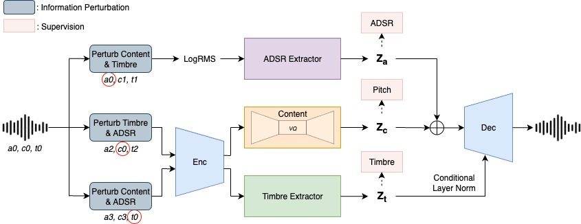

 

<h1>SynthCloner: Synthesizer Preset Conversion via Factorized Codec with Disentangled Timbre and ADSR Control</h1>

Jeng-Yue Liu1, 2, Ting-Chao Hsu1, Yen-Tung Yeh1, Li Su2, Yi-Hsuan Yang1

1 National Taiwan University

2 Academia Sinica

## Abstract

This collection presents 32 audio pairs, each containing 6 distinct audio files for comprehensive audio analysis and comparison. Each pair includes original audio, reference audio, ground truth audio, proposed model, CTD <a href="#note1" id="note1ref">[1]</a>, and SS-VQVAE <a href="#note2" id="note2ref">[2]</a>, enabling detailed evaluation of multiple audio processing methods and reconstruction quality. The dataset provides a standardized framework for comparing different audio reconstruction approaches across various audio content types. Code is available <a href="https://github.com/buffett0323/query_ss">here</a>

 
Figure 1: SynthCloner model framework

## ADSR Definition
As shown in Figure 2, ADSR stands for <b>Attack</b>, <b>Decay</b>, <b>Sustain</b>, <b>Release</b>, and it is a standard envelope model used in sound synthesis to shape how a note evolves over time. The attack phase, illustrated by the initial rising slope, is the time it takes for the sound to rise from silence to its maximum amplitude after a note is pressed. The decay phase follows, shown by the descending curve, describing how quickly the sound decreases from the peak to the sustain level. The sustain, represented by the horizontal line, is not a time but a level, representing the steady amplitude maintained as long as the note is held. Finally, the release phase, depicted by the final downward slope, is the time it takes for the sound to fade back to silence after the note is released. Together, these 4 stages give electronic instruments their dynamic and expressive qualities, mimicking the way acoustic instruments naturally produce sound.

 
Figure 2: Visualization of the ADSR envelope

## Preset Conversion Experiments with Audio Pairs

This section presents some audio pairs used in the preset conversion experiments, organized into three groups based on ADSR characteristics. For each pair, we provide the original audio, reference audio, ground-truth reconstruction, our proposed model output, CTD, and SS-VQVAE. As illustrated in Figure 1, the model disentangles the input into three latent factors: ADSR, Content, and Timbre. In these experiments, we retain the Content features from the original audio while replacing the ADSR and Timbre features with those from the reference. Concretely, if the original audio is represented as $(A_1, C_1, T_1)$ and the reference as $(A_2, C_2, T_2)$, the reconstructed output is expected to yield $(A_2, C_1, T_2)$.

### Normal Cases

<table class="table table-sm text-center" style="vertical-align: middle;">
  <colgroup>
      <col style="width: 120px;">
      <col style="width: 160px;">
      <col style="width: 160px;">
      <col style="width: 160px;">
      <col style="width: 160px;">
      <col style="width: 160px;">
      <col style="width: 160px;">
    </colgroup>
  <thead>
    <tr>
      <th style="text-align:center;">Pair ID</th>
      <th style="text-align:center;">Original</th>
      <th style="text-align:center;">Reference</th>
      <th style="text-align:center;">Ground Truth</th>
      <th style="text-align:center;">Proposed</th>
      <th style="text-align:center;">CTD</th>
      <th style="text-align:center;">SSVQVAE</th>
    </tr>
  </thead>
  <tbody>
    <tr>
      <td>Pair 1-1</td>
      <td><audio src="audios/01_orig.wav" controls style="width: 160px"></audio></td>
      <td><audio src="audios/01_ref.wav" controls style="width: 160px"></audio></td>
      <td><audio src="audios/01_gt.wav" controls style="width: 160px"></audio></td>
      <td><audio src="audios/01_recon_no_mask.wav" controls style="width: 160px"></audio></td>
      <td><audio src="audios/01_recon_ctd.wav" controls style="width: 160px"></audio></td>
      <td><audio src="audios/01_recon_ssvqvae.wav" controls style="width: 160px"></audio></td>
    </tr>
    <tr>
      <td>Pair 1-2</td>
      <td><audio src="audios/02_orig.wav" controls style="width: 160px"></audio></td>
      <td><audio src="audios/02_ref.wav" controls style="width: 160px"></audio></td>
      <td><audio src="audios/02_gt.wav" controls style="width: 160px"></audio></td>
      <td><audio src="audios/02_recon_no_mask.wav" controls style="width: 160px"></audio></td>
      <td><audio src="audios/02_recon_ctd.wav" controls style="width: 160px"></audio></td>
      <td><audio src="audios/02_recon_ssvqvae.wav" controls style="width: 160px"></audio></td>
    </tr>
    <tr>
      <td>Pair 1-3</td>
      <td><audio src="audios/03_orig.wav" controls style="width: 160px"></audio></td>
      <td><audio src="audios/03_ref.wav" controls style="width: 160px"></audio></td>
      <td><audio src="audios/03_gt.wav" controls style="width: 160px"></audio></td>
      <td><audio src="audios/03_recon_no_mask.wav" controls style="width: 160px"></audio></td>
      <td><audio src="audios/03_recon_ctd.wav" controls style="width: 160px"></audio></td>
      <td><audio src="audios/03_recon_ssvqvae.wav" controls style="width: 160px"></audio></td>
    </tr>
    <tr>
      <td>Pair 1-4</td>
      <td><audio src="audios/06_orig.wav" controls style="width: 160px"></audio></td>
      <td><audio src="audios/06_ref.wav" controls style="width: 160px"></audio></td>
      <td><audio src="audios/06_gt.wav" controls style="width: 160px"></audio></td>
      <td><audio src="audios/06_recon_no_mask.wav" controls style="width: 160px"></audio></td>
      <td><audio src="audios/06_recon_ctd.wav" controls style="width: 160px"></audio></td>
      <td><audio src="audios/06_recon_ssvqvae.wav" controls style="width: 160px"></audio></td>
    </tr>
    <tr>
      <td>Pair 1-5</td>
      <td><audio src="audios/08_orig.wav" controls style="width: 160px"></audio></td>
      <td><audio src="audios/08_ref.wav" controls style="width: 160px"></audio></td>
      <td><audio src="audios/08_gt.wav" controls style="width: 160px"></audio></td>
      <td><audio src="audios/08_recon_no_mask.wav" controls style="width: 160px"></audio></td>
      <td><audio src="audios/08_recon_ctd.wav" controls style="width: 160px"></audio></td>
      <td><audio src="audios/08_recon_ssvqvae.wav" controls style="width: 160px"></audio></td>
    </tr>
    <tr>
      <td>Pair 1-6</td>
      <td><audio src="audios/10_orig.wav" controls style="width: 160px"></audio></td>
      <td><audio src="audios/10_ref.wav" controls style="width: 160px"></audio></td>
      <td><audio src="audios/10_gt.wav" controls style="width: 160px"></audio></td>
      <td><audio src="audios/10_recon_no_mask.wav" controls style="width: 160px"></audio></td>
      <td><audio src="audios/10_recon_ctd.wav" controls style="width: 160px"></audio></td>
      <td><audio src="audios/10_recon_ssvqvae.wav" controls style="width: 160px"></audio></td>
    </tr>
    <tr>
      <td>Pair 1-7</td>
      <td><audio src="audios/11_orig.wav" controls style="width: 160px"></audio></td>
      <td><audio src="audios/11_ref.wav" controls style="width: 160px"></audio></td>
      <td><audio src="audios/11_gt.wav" controls style="width: 160px"></audio></td>
      <td><audio src="audios/11_recon_no_mask.wav" controls style="width: 160px"></audio></td>
      <td><audio src="audios/11_recon_ctd.wav" controls style="width: 160px"></audio></td>
      <td><audio src="audios/11_recon_ssvqvae.wav" controls style="width: 160px"></audio></td>
    </tr>
    <tr>
      <td>Pair 1-8</td>
      <td><audio src="audios/12_orig.wav" controls style="width: 160px"></audio></td>
      <td><audio src="audios/12_ref.wav" controls style="width: 160px"></audio></td>
      <td><audio src="audios/12_gt.wav" controls style="width: 160px"></audio></td>
      <td><audio src="audios/12_recon_no_mask.wav" controls style="width: 160px"></audio></td>
      <td><audio src="audios/12_recon_ctd.wav" controls style="width: 160px"></audio></td>
      <td><audio src="audios/12_recon_ssvqvae.wav" controls style="width: 160px"></audio></td>
    </tr>
    <tr>
      <td>Pair 1-9</td>
      <td><audio src="audios/13_orig.wav" controls style="width: 160px"></audio></td>
      <td><audio src="audios/13_ref.wav" controls style="width: 160px"></audio></td>
      <td><audio src="audios/13_gt.wav" controls style="width: 160px"></audio></td>
      <td><audio src="audios/13_recon_no_mask.wav" controls style="width: 160px"></audio></td>
      <td><audio src="audios/13_recon_ctd.wav" controls style="width: 160px"></audio></td>
      <td><audio src="audios/13_recon_ssvqvae.wav" controls style="width: 160px"></audio></td>
    </tr>
    <tr>
      <td>Pair 1-10</td>
      <td><audio src="audios/14_orig.wav" controls style="width: 160px"></audio></td>
      <td><audio src="audios/14_ref.wav" controls style="width: 160px"></audio></td>
      <td><audio src="audios/14_gt.wav" controls style="width: 160px"></audio></td>
      <td><audio src="audios/14_recon_no_mask.wav" controls style="width: 160px"></audio></td>
      <td><audio src="audios/14_recon_ctd.wav" controls style="width: 160px"></audio></td>
      <td><audio src="audios/14_recon_ssvqvae.wav" controls style="width: 160px"></audio></td>
    </tr>
  </tbody>
</table>

### Short2Long

<table class="table table-sm text-center" style="vertical-align: middle;">
  <colgroup>
      <col style="width: 120px;">
      <col style="width: 160px;">
      <col style="width: 160px;">
      <col style="width: 160px;">
      <col style="width: 160px;">
      <col style="width: 160px;">
      <col style="width: 160px;">
    </colgroup>
  <thead>
    <tr>
      <th style="text-align:center;">Pair ID</th>
      <th style="text-align:center;">Original</th>
      <th style="text-align:center;">Reference</th>
      <th style="text-align:center;">Ground Truth</th>
      <th style="text-align:center;">Proposed</th>
      <th style="text-align:center;">CTD</th>
      <th style="text-align:center;">SSVQVAE</th>
    </tr>
  </thead>
  <tbody>
    <tr>
      <td>Pair 2-1</td>
      <td><audio src="audios/04_orig.wav" controls style="width: 160px"></audio></td>
      <td><audio src="audios/04_ref.wav" controls style="width: 160px"></audio></td>
      <td><audio src="audios/04_gt.wav" controls style="width: 160px"></audio></td>
      <td><audio src="audios/04_recon_no_mask.wav" controls style="width: 160px"></audio></td>
      <td><audio src="audios/04_recon_ctd.wav" controls style="width: 160px"></audio></td>
      <td><audio src="audios/04_recon_ssvqvae.wav" controls style="width: 160px"></audio></td>
    </tr>
    <tr>
      <td>Pair 2-2</td>
      <td><audio src="audios/07_orig.wav" controls style="width: 160px"></audio></td>
      <td><audio src="audios/07_ref.wav" controls style="width: 160px"></audio></td>
      <td><audio src="audios/07_gt.wav" controls style="width: 160px"></audio></td>
      <td><audio src="audios/07_recon_no_mask.wav" controls style="width: 160px"></audio></td>
      <td><audio src="audios/07_recon_ctd.wav" controls style="width: 160px"></audio></td>
      <td><audio src="audios/07_recon_ssvqvae.wav" controls style="width: 160px"></audio></td>
    </tr>
    <tr>
      <td>Pair 2-3</td>
      <td><audio src="audios/09_orig.wav" controls style="width: 160px"></audio></td>
      <td><audio src="audios/09_ref.wav" controls style="width: 160px"></audio></td>
      <td><audio src="audios/09_gt.wav" controls style="width: 160px"></audio></td>
      <td><audio src="audios/09_recon_no_mask.wav" controls style="width: 160px"></audio></td>
      <td><audio src="audios/09_recon_ctd.wav" controls style="width: 160px"></audio></td>
      <td><audio src="audios/09_recon_ssvqvae.wav" controls style="width: 160px"></audio></td>
    </tr>
    <tr>
      <td>Pair 2-4</td>
      <td><audio src="audios/15_orig.wav" controls style="width: 160px"></audio></td>
      <td><audio src="audios/15_ref.wav" controls style="width: 160px"></audio></td>
      <td><audio src="audios/15_gt.wav" controls style="width: 160px"></audio></td>
      <td><audio src="audios/15_recon_no_mask.wav" controls style="width: 160px"></audio></td>
      <td><audio src="audios/15_recon_ctd.wav" controls style="width: 160px"></audio></td>
      <td><audio src="audios/15_recon_ssvqvae.wav" controls style="width: 160px"></audio></td>
    </tr>
  </tbody>
</table>

### Long2Short

<table class="table table-sm text-center" style="vertical-align: middle;">
  <colgroup>
      <col style="width: 120px;">
      <col style="width: 160px;">
      <col style="width: 160px;">
      <col style="width: 160px;">
      <col style="width: 160px;">
      <col style="width: 160px;">
      <col style="width: 160px;">
    </colgroup>
  <thead>
    <tr>
      <th style="text-align:center;">Pair ID</th>
      <th style="text-align:center;">Original</th>
      <th style="text-align:center;">Reference</th>
      <th style="text-align:center;">Ground Truth</th>
      <th style="text-align:center;">Proposed</th>
      <th style="text-align:center;">CTD</th>
      <th style="text-align:center;">SSVQVAE</th>
    </tr>
  </thead>
  <tbody>
    <tr>
      <td>Pair 3-1</td>
      <td><audio src="audios/05_orig.wav" controls style="width: 160px"></audio></td>
      <td><audio src="audios/05_ref.wav" controls style="width: 160px"></audio></td>
      <td><audio src="audios/05_gt.wav" controls style="width: 160px"></audio></td>
      <td><audio src="audios/05_recon_no_mask.wav" controls style="width: 160px"></audio></td>
      <td><audio src="audios/05_recon_ctd.wav" controls style="width: 160px"></audio></td>
      <td><audio src="audios/05_recon_ssvqvae.wav" controls style="width: 160px"></audio></td>
    </tr>
    <tr>
      <td>Pair 3-2</td>
      <td><audio src="audios/16_orig.wav" controls style="width: 160px"></audio></td>
      <td><audio src="audios/16_ref.wav" controls style="width: 160px"></audio></td>
      <td><audio src="audios/16_gt.wav" controls style="width: 160px"></audio></td>
      <td><audio src="audios/16_recon_no_mask.wav" controls style="width: 160px"></audio></td>
      <td><audio src="audios/16_recon_ctd.wav" controls style="width: 160px"></audio></td>
      <td><audio src="audios/16_recon_ssvqvae.wav" controls style="width: 160px"></audio></td>
    </tr>
  </tbody>
</table>

## Dataset render

## References 

<a id="note1" href="#note1ref">[1]</a> N. Demerlé, P. Esling, G. Doras, and D. Genova, “Combining audio control and style transfer using latent diffusion,” in Proc. International Society for Music Information Retrieval (ISMIR), 2024

<a id="note2" href="#note2ref">[2]</a> O. Cífka, A. Ozerov, U.  ̧Sim ̧sekli, and G. Richard “Self-supervised vq-vae for one-shot music style transfer,” in ICASSP 2021-2021 IEEE International Conference on Acoustics, Speech and Signal Processin(ICASSP). IEEE, 2021, pp. 96–100
